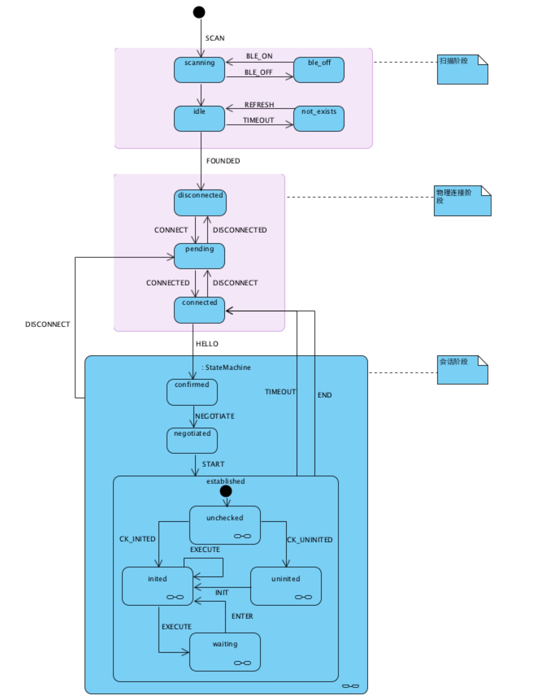

# Nanopb
- 本项目中的protobuf接口，用于与硬件钱包设备进行通信中的编解码，使用了适合嵌入式设备的nanopb插件，所以ios、android、pc端都需要使用nanopb
编译出的c代码库。

- c代码只负责报文的序列化与反序列化，而不负责与设备的具体通信，具体通信（蓝牙或声波）要在上层实现。

- 使用环形缓冲区进行处理。第一个byte是缓冲区类型（消息ID），后续二个字节是消息大小，然后跟着的是消息缓冲区。

你参考一下这个安卓的app代码，直接把protobuf的格式化后的数据直接发出来到设备上就行了

## Embeded代码
- [Embeded](https://coding.net/u/xman/p/Icebox-embed/git/tree/master/7697/project/linkit7697_hdk/apps/iot_sdk)
- 通信密钥的交换：nist256p1的ecdh算法
- 设备的初始化应该直接在设备就可以完成了，不需要和手机交互

## 蓝牙example 
- [linkit-7697-ble-serial](https://github.com/MediaTek-Labs/linkit-7697-ble-serial): How to use BLE to do serial communication on LinkIt 7697 HDK
- [linkit-7697-ble-smart-connection](https://github.com/MediaTek-Labs/linkit-7697-ble-smart-connection): How to use BLE to do smart connection on LinkIt 7697 HDK

## 与设备的交互

- 分为三个阶段：
    1. 扫描阶段
        - 确定是否打开了蓝牙，没有则提示用户打开蓝牙
        - 如果已经打开了蓝牙，则开始扫描蓝牙设备
    2. 物理连接阶段
        - 连接蓝牙设备
    3. 会话阶段
        - 与蓝牙设备建立会话
        
## Coin Type
- bitcoin: secp256k1
- ethereum: secp256k1
- cryptonote: ed25519
- ripple: ed25519

## 创建比特币交易
- createRawTransaction
- signRawTransaction

## List address
- select * from addresses where t2 = tp limit 4 offset = x

Develop log
------------
7.1
  1. 为增加安全性，为所有的消息的末尾增加了 salt 字段，类型为uint32, 编号统一为16, 
     设备端返回的消息需要将该值加一，并返回给app侧。
  2. start 和 end 消息修改为start_session, end_session。
  3. 给各个消息增加了说明，描述消息的用途。

6.14
  1. 所有的bytes, string字段都必须加上max_size的限制
  2. HiRequest, HiReply已经修改为HelloRequest, HelloReply
  3. 移除ConversationRequest和ConversationReply, 其功能已经被IceboxMessage实现
